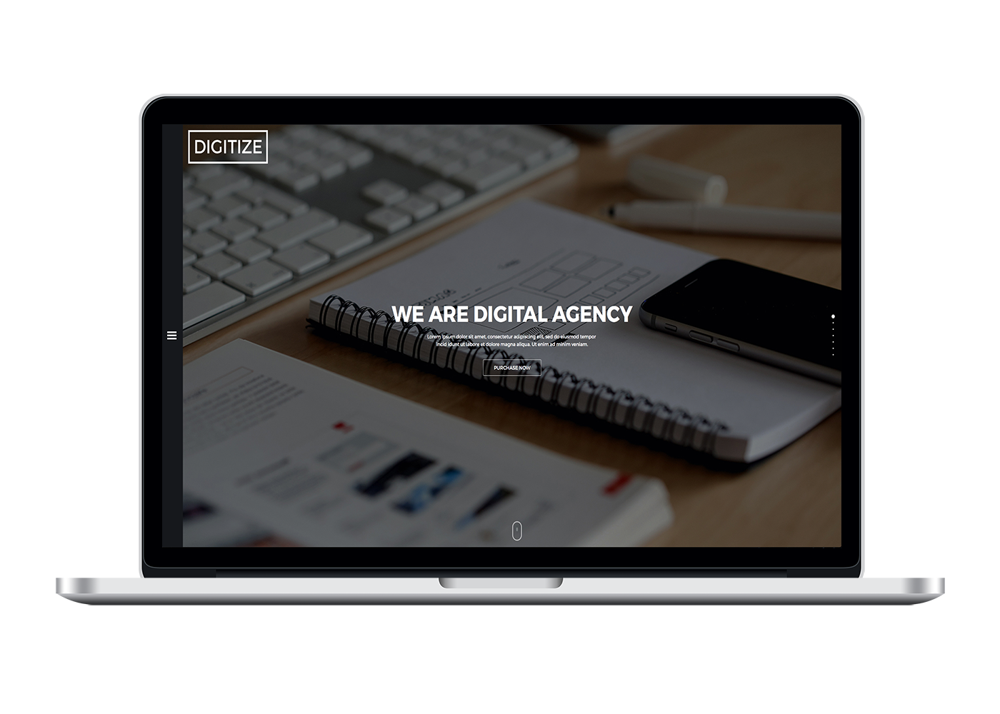

# Digitize HTML Template

Digitize is a minimal, multi-purpose and universal portfolio agency HTML template, suitable for freelancers, agencies and photographers. With many features and well-written code it is one of the most flexible and easy-to-use HTML templates out there. 
http://rogatnev-nikita.github.io/digitize-theme/html/

<h4>Features</h4>
<ul>
  <li>Minimal</li>
  <li>Universal & Multi-purpose</li>
  <li>Retina ready</li>
  <li>Fully responsive</li>
  <li>HTML5 & CSS3</li>
  <li>Subtle CSS3 Animations</li>
  <li>Well-documented</li>
  <li>SEO friendly</li>
  <li>Google Fonts Support</li>
</ul>

<h4>Summary</h4>
<ul>
  <li>High Resolution: Yes</li>
  <li>Compatible Browsers: IE11, Firefox, Safari, Opera, Chrome, Edge</li>
  <li>Files Included: HTML Files, CSS Files, JS Files, demo images</li>
  <li>Columns: N/A</li>
  <li>Documentation: Well Documented</li>
  <li>Layout: Responsive</li>
  <li>Category: creative, corporate, technology</li>
  <li>Tags: clean, minimal, creative, modern, responsive, mobile, jquery, html5, css3, contact form, personal, business, corporate, agency, portfolio, designer, freelancer, photographer, universal</li>
</ul>

<h4>File structure</h4>
    +-- fonts /
    ¦    +-- all fonts used
    +-- images /
    ¦    +-- all images used
    +-- styles /
    ¦    +-- main.css
    +-- scripts /
    ¦	+-- jquery.fullPage.js
    ¦	+-- jquery.js
    ¦	+-- main.js
    +-- 404.html
    +-- blog.html
    +-- index.html
    +-- robots.txt
    +-- typography.html
    
<h4>Sources & Credits</h4>
<ul>
  <li>
    <strong>jquery.fullPage.js</strong> 
    normalize.css v2.6.6 
    Copyright © alvarotrigo.com - A project by Alvaro Trigol 
    Licensed under MIT (https://github.com/alvarotrigo/fullPage.js)
  </li>
  <li>
    <strong>Font Awesome</strong> 
    font-awesome.min.css v4.5.0 
    Copyright © Dave Gandy 
    Licensed under MIT (http://fontawesome.io/license/)
  </li>                
  <li>
    <strong>jQuery</strong> 
    jquery.min.js v3.0.0-beta1 
    Licensed under MIT (https://jquery.org/license/)
  </li>
  <li>
    <strong>Fonts by Google Webfonts</strong> 
    Montserrat (https://www.google.com/fonts/specimen/Montserrat)
  </li>
  <li>
    <strong>Images</strong> 
    The images included in the template are for demonstration purposes only. 
      <ul>
        <li>images/intro/intro.jpg - (https://picjumbo.com/webdesign-work-in-progress/)
        <li>images/blog/intro--blog.jpg - (https://picjumbo.com/office-work-things/)
        <li>images/blog/blog-item.jpg - (https://picjumbo.com/man-checking-his-iphone-working-at-home-office/)
        <li>images/portfolio/portfolio__image--1.gif - (https://dribbble.com/shots/2038429-Acorns-Security-Visualization)</li>
        <li>images/portfolio/portfolio__image--2.gif - (https://dribbble.com/shots/999246-Website-GIF)</li>
        <li>images/portfolio/portfolio__image--3.gif - (https://dribbble.com/shots/1008912-UX-mag-redesign-GIF)</li>
        <li>images/portfolio/portfolio__image--4.gif - (https://dribbble.com/shots/2497696-The-new-Yalantis-website)</li>
      </ul>
  </li>
</ul>
